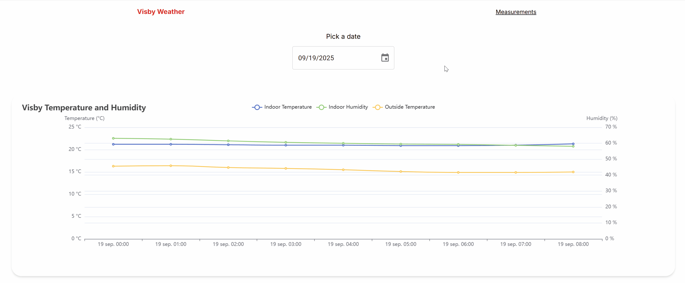
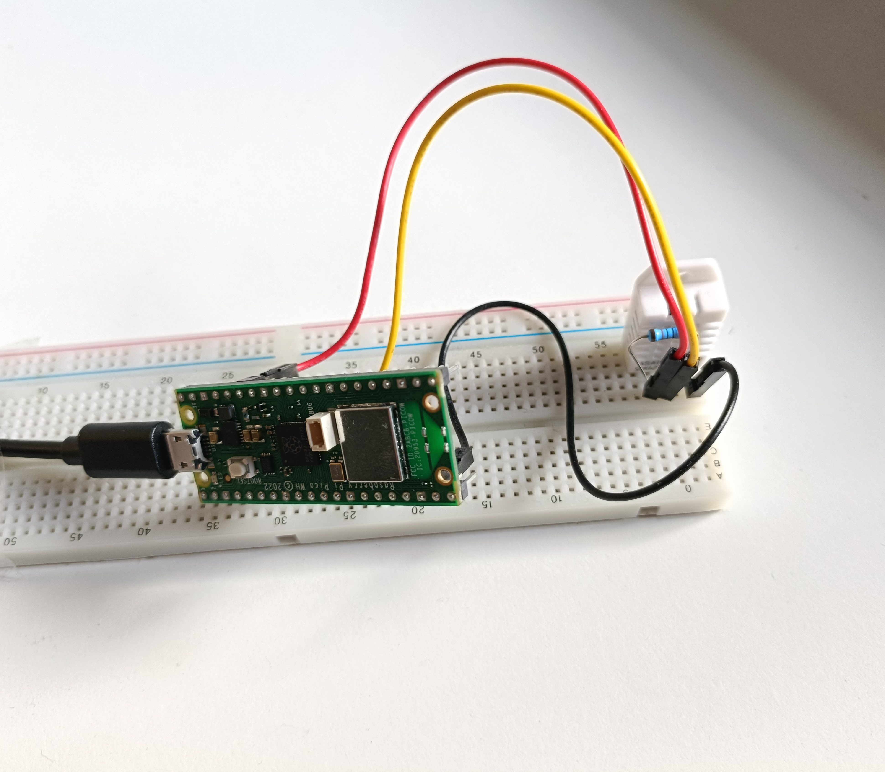
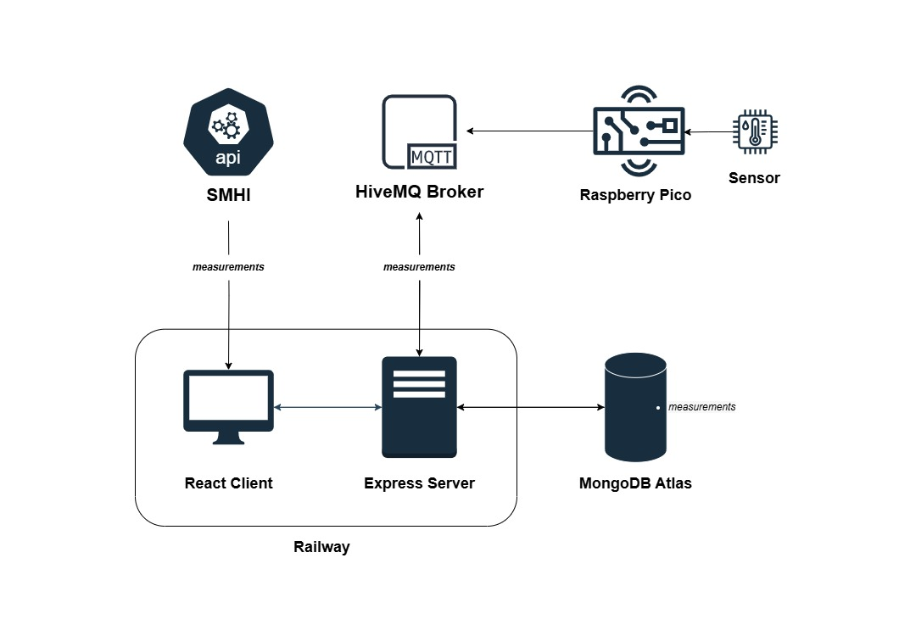

# Visby Weather App

## Project Description

This IoT project utilizes a Rapsberry Pi Pico with a sensor along with the SMHI weather API to visualize temperature and humidity data captured in Visby, Gotland, Sweden. 

The sensor data provides insight in the indoor and outdoor temmperature as well as the hummidity levels of my house in Visby. The outdoor temperature is collected from SMHIs public API which is collected from a sensor at Visby airport.

My sensor is currently active and collects data. Archived data can be viewd between June 15 to July 15 from initial testing.

## How to Use
- Navigate to the meassurements tab. 
- Pick a date to visualize data. The default date is the current date.
- Hover over the graph to display both temperature and humidity levels of that time of day.

**Demo**

## Core Technologies

**Tech stack:** 
- React - _Frontend_
- Express - _Backend_
- HiveMQ - _MQTT Broker_
- MongoDB Atlas - _Database_
- Railway - _Production Environment_

**Hardware**
- Raspberry Pi Pico WH - Microcontroller 
- DHT22 - Sensor

## Setup and Data flow
This is the hardware used.

Here's an architectural overview of both hardware and software.

The Raspberry Pico is connected to the sensor on a breadboard. The sensor reads temperature and humidity data which is collected by the Raspberry Pico. The Raspberry Pico is connected to WIFI which allow it to send the data to the HiveMQ public broker with a unique clientID and topics for temperature and humidity. Every 30 seconds the sensor data is read and sent to the HiveMQ broker via the MQTT protocol.
The following script was used. [Raspberry Pi Pico Script](.readme/pico_script.py)

The **Express** backend is connected to the HiveMQ public broker and subscribes to the _rp222nc/temperature_ and _rp222nc/humidity_ topics. When new data is available, the backend saves the data to the MongoDB Atlas database. The data is indexed to speed up fetching it. When data is requested it can be filtered by date as well as limited. The data can also be aggregated to give the average of a specified time. For example an average of every reading per hour instead of every datapoint for that hour.

The **React** frontend has a _FetchService_ to fetch sensor data from the backend as well as current and archived data from SMHIs API. Webcomponents have been created with the help of Echarts and Material UI. These webcomponents allow users to interact and visualize the data by selecting a date which then presents a graph with both datasets to allow for analysis.  

**Railway** was used to deploy the application. I've used Vercel earlier but Vercel is serverless which doesn't work for this application which lead me to Railway. It is compatible with many frameworks and is easy to push to deployment with CI/CD pipelines.

## Link to the Deployed Application

- [Backend](https://weather-server-production-e358.up.railway.app/)
- [Client](https://weather-client-production.up.railway.app/)
- [Github Backend](https://github.com/RobinPett/weather-server)
- [Github Client](https://github.com/RobinPett/weather-client)

## Acknowledgements

Resources I've used:
- [Echarts](https://echarts.apache.org/examples)
- [Material UI](https://mui.com/material-ui)